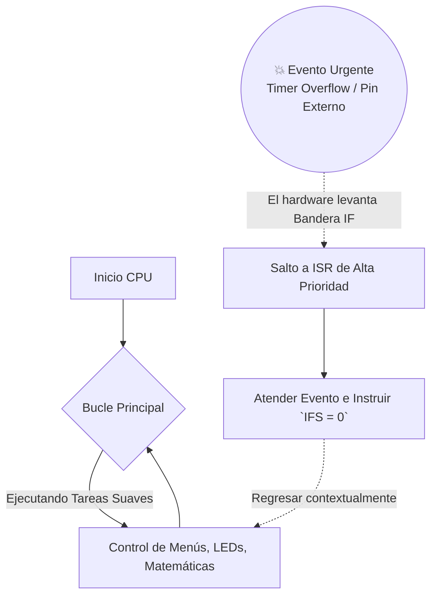
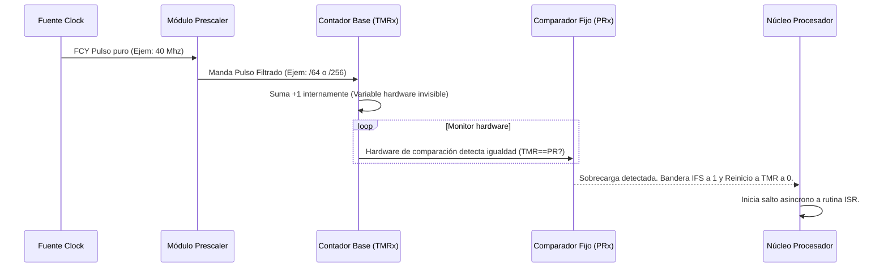

# 🚀 Guía Definitiva: Sistema de Interrupciones y Timers (dsPIC33F)

> [!NOTE]
> **Origen:** Este documento es una síntesis unificada, corregida y mejorada pedagógicamente.
> **Fuentes procesadas para esta unificación:** Family Reference Manual (Secciones 6 y 11), Datasheet dsPIC33F (Sec. 7, 12, 13), Trabajos Prácticos y material complementario de cátedra de la materia.

---

## 1. El Concepto Funcional de las Interrupciones

Una **Interrupción** es una asimetría obligatoria en el flujo del software: es una señal originada en **hardware** o software periférico que le exige atención inmediata y absoluta a la CPU. 
Al dispararse, la CPU "congela" su trabajo principal, guarda su contexto en la pila (`Stack`), atiende la emergencia mediante una **ISR** (rutina de servicio de interrupción), y finalmente, ejecuta una instrucción en ensamblador llamada `RETFIE` para volver al hilo principal en el punto exacto donde se detuvo.

### 1.1 Diferencia Crítica: Interrupción vs Polling

> [!WARNING]
> **El problema del Polling:** Hacer una inspección en bucle cerrado (Polling) consume al $100\%$ el CPU preguntando indefinidamente variables del estilo *"¿Pulsaron el botón?"* o *"¿Me llegó un dato?"*. 
> **La solución:** Entregar este monitoreo al hardware de interrupciones libera de carga inútil a tu hilo principal y permite incorporar **Multitarea (Multitasking)** real.



### 1.1.1 El "Congelamiento" a Bajo Nivel (Uso de W15 y la Pila)

En la arquitectura del dsPIC33, el registro **W15 actúa físicamente como el Puntero de Pila (Stack Pointer - SP)**.
Cuando ocurre una interrupción legítima, el hardware no simplemente "pausa" el código por arte de magia, sino que ejecuta una secuencia estricta y automática en nanosegundos (aprox 4 a 5 ciclos de instrucción):

1. **Fin de ciclo:** La CPU termina de ejecutar la instrucción que estaba procesando en ese instante exacto para evitar corrupción.
2. **Salvamento del PC:** En ese momento, la CPU necesita recordar en qué línea de código iba. Para ello, toma el **PC (Program Counter)** actual (que marca la dirección exacta por donde iba el `main`) y lo **apila (push) en la Pila (Stack)** utilizando la dirección de memoria apuntada por **W15**. 
3. **Salvamento del SR:** Además del PC, el hardware automáticamente apila la parte baja del Registro de Estado (**SRL**), que contiene información valiosa como si había "acarreo" (Carry) o si el resultado anterior fue Cero (Zero). Al hacer esto, **W15** se incrementa automáticamente para apuntar a la nueva cima vacía de la pila.
4. **Barrera de Prioridad:** La CPU actualiza sus propios bits **IPL** en el Status Register para igualarlos a la prioridad de la interrupción entrante. Si entra el Timer1 configurado en nivel 6, la CPU se eleva a nivel 6. *Ninguna otra interrupción de nivel 5 o menor podrá interrumpirla ahora.*
5. **El Salto al IVT:** Ahora que sus "recuerdos" están seguros en la pila de W15, el PC se sobreescribe con la dirección alojada en la **Tabla de Vectores (IVT)** y la función `_TxInterrupt` comienza a correr.
6. **Despertar (`RETFIE`):** Cuando la función C encuentra la última llave `}`, el compilador inyectó silenciosamente allí la instrucción en ensamblador **`RETFIE`** (Return From Interrupt). Esta mágica instrucción obliga al CPU a hacer todo el proceso inverso: **Desapila el SR y el PC** (restándole a W15) y reanuda el `main` con absoluto disimulo.

> [!TIP]
> **Registros Sombra (Shadow Registers):** En el dsPIC33, si tu interrupción tiene la máxima prioridad de todas (**Nivel 7**), el hardware tiene un truco extra: no gasta tiempo apilando tus registros de trabajo (W0 a W3), sino que los copia instantáneamente a unos registros "sombra". ¡Por eso una interrupción de Nivel 7 arranca mucho más rápido que las demás!

### 1.1.2 Mapa de Memoria: ¿Dónde están ubicados físicamente?
El dsPIC33 utiliza una **Arquitectura Harvard Modificada**, lo que significa que la "Memoria de Programa" (Memoria Flash / ROM) donde vive tu código y la "Memoria de Datos" (RAM) para tus variables, tienen números de direcciones completamente distintos y separados.

| Componente | Residencia de Hardware | Dirección Física (Hexadecimal) | Descripción Lógica |
| :--- | :--- | :--- | :--- |
| **W15 (Stack Pointer) y W0-W14** | **Memoria de Datos** (RAM) | `0x0000` a `0x001E` | Aunque W15 gestiona el cerebro de la CPU, está mapeado como SFR al **inicio absoluto** de la memoria de Datos. El propio registro W15 ocupa la dirección física `0x001E`. |
| **La Pila (Memoria del Stack)** | **Memoria de Datos** (RAM) | Suele iniciar a partir de `0x0800`* | La gigantesca Pila donde se guardan los retornos y variables temporales vive en la memoria RAM general. Empieza en el primer hueco libre que deje tu código C después de declarar las variables globales. Cuidado: Crece hacia "arriba" (hacia direcciones de mayor numeración). |
| **Tabla Vectores (IVT)** | **Memoria de Programa** (Flash) | `0x000004` a `0x0000FF` | Es índice fijo (hardware). Grabado en memoria No Volátil, asegura que, sin importar apagones, los eventos de hardware siempre sepan su dirección vital. |
| **Tabla Alternativa (AIVT)** | **Memoria de Programa** (Flash) | `0x000100` a `0x0001FF` | Opcional, continúa justo debajo de la principal. Protegida contra modificaciones erráticas. |
| **Tu Código C (Main e ISR)** | **Memoria de Programa** (Flash) | De `0x000200` en adelante | Las instrucciones ensambladas reales de tu programa empiezan aquí, y es aquí a donde apunta el contenido matemático almacenado adentro de la IVT. |
*(Nota del compilador: Los primeros ~2 Kilobytes de RAM `0x0000-0x07FF` están reservados exclusivamente para los registros especiales (SFR) y los núcleos del dsPIC).*

> [!NOTE]
> **¿Por qué las direcciones de Programa son más largas (`0x000200`) que las de Datos (`0x0800`)?**
> ¡Alguien prestó atención a los ceros! El dsPIC33 es un micro de **16 bits**, por lo que su Memoria de Datos (RAM) es pequeña y rápida, direccionándose con 16 bits limitados a 4 dígitos hexadecimales (máximo `0xFFFF`). 
> Sin embargo, las instrucciones operativas (tu código C convertido a máquina) ocupan un ancho enorme de **24 bits** cada una. Para albergar e identificar instrucciones tan anchas, el **Program Counter (PC)** y el bus de la Memoria de Programa están diseñados físicamente a 24 bits, expresándose en 6 dígitos hexadecimales (por eso el IVT empieza en un largo `0x000004` y no en un `0x04`).

### 1.2 Anatomía del Directorio: La Tabla IVT
Para no correr en el caos, el dsPIC cuenta con un mapa exacto "grabado a fuego" en su memoria Flash (empezando en la dirección `0x000004`) llamado **IVT (Interrupt Vector Table)**. 
Cada vez que llega una interrupción válida, el hardware ubica la prioridad de ese evento y hace una consulta matemática a esta tabla para encontrar en qué línea oculta de memoria empieza la función C que tú programaste para salvarlo.

### 1.3 Las "Trampas" (Traps) vs Las "Interrupciones"
Una trampa es conceptualmente idéntica a una interrupción, salvo por un gran detalle: **Las trampas son indiscutibles y no enmascarables**.
Las trampas ostentan los niveles de prioridad de CPU 8 a 15 (los valores superiores absolutos que existen).
- **Hard Traps:** Reacciona a fallas del oscilador central o a un error crítico de dirección. Detienen al CPU por el cuello para que no destruya memoria crítica.
- **Soft Traps:** Errores como `Stack Overflow` o un error matemático (escrutar una división por 0 en la ALU). Al ser suaves, la CPU permitirá completar la instrucción en tránsito antes de saltar a la trampa para registrar el daño.

---

## 2. Los Cuatro Pilares: Registros de Control

Microchip estructuró todo su motor de interrupciones utilizando 4 sufijos clave en sus arquitecturas. Si comprendes esta matriz, no existirá obstáculo al configurar interrupciones en ningún sistema Microchip.

| Registro | Funcionalidad en Hardware | Analogía de Concepto 💡 |
| :--- | :--- | :--- |
| **IFSx** (*Interrupt Flag Status*) | Es el "detector". El hardware la clava forzosamente en `1` cuando ocurre el suceso electrónico. **OBLIGACIÓN PROG:** Una vez iniciada la función, el código debe volver a limpiarla escribiéndole a nivel bit un `0` manual, o fallará catastróficamente la ISR repetitiva. | El sonido vibrante del timbre que avisa de una urgencia. |
| **IECx** (*Interrupt Enable Control*) | Es el enmascarador maestro del timbre. Si está forzado a `0`, la señal de urgencia electrónica puede chillar fuerte afectando al `IFS` continuamente, pero **el procesador nunca lo "escuchará"** ni detendrá el código general. | El control físico para bloquear/cortar alarmas. |
| **IPCx** (*Interrupt Priority Control*) | Registra qué nivel de urgencia asumes para dicho periférico. Varía del 0 (Ignorar todo) al 7 (Urgencia Extrema Máxima). | Es el sistema de Triaje de un Hospital para ceder paso a las peores variables. |
| **INTCONx** (*Interrupt Control*) | Son configuraciones universales arquitectónicas. Gobiernan temas profundos como la anulación del **anidamiento** o de forma particular las polaridades activas (configurar que un flanco se dispare de 1 a 0 en vez de 0 a 1). | Las normas estatales de funcionamiento del Hospital mismo. |

> [!CAUTION]  
> **Prioridad Natural (Conflicto Matemático):** ¿Qué ocurre si dos módulos periféricos explotan al mismo tiempo exacto y tú les habías establecido a ambos por código la misma prioridad de urgencia `(Ej. IPC = 5)`?
> En este escenario de empate absoluto, la CPU resolverá la crisis revisando los números de Vector ordenados de su IVT; el valor numérico menor dictará precedencia sobre el otro (Ej. INT0 atenderá antes que el Timer3 porque INT0 está codificado más arriba en el silicio).

> [!NOTE]
> **¿Dónde encuentro la información de Hardware y Pines (`INTx`) en la bibliografía oficial?**
> - 📄 [**`dsPic33FJ256GP710-70286C (Datasheet).pdf`**](file:///d:/Escritorio/INFORMATICA/ARQUITECTURA%20DE%20COMPUTADORAS/dsPic33FJ256GP710-70286C%20(Datasheet).pdf) *(Manual específico del chip real)*
>   - **Mapeo Físico:** En la sección inicial **"Pin Diagrams" (Aprox. Páginas 4 a 10)**. Busca las patas rotuladas como `INT0`, `INT1`, o `CNx`. *(Cuidado: están "multiplexados", es decir, comparten pata con los pines normales como RB7).*
>   - **Registros dedicados:** **Sección 7.0 "Interrupt Controller"**. Enumera exactamente qué vectores posee tu chip.
> - 📄 [**`DsPIC33 - Interrupts -DS70184b.pdf`**](file:///d:/Escritorio/INFORMATICA/ARQUITECTURA%20DE%20COMPUTADORAS/PRACTICA%202/DsPIC33%20-%20Interrupts%20-DS70184b.pdf) *(Family Reference Manual)*
>   - Explica el concepto profundo de arquitectura **(Section 6)**, pero obvia los números de pines porque sirve para más de 100 procesadores dsPIC distintos.

---

## 3. Temporizadores Cíclicos (Los Módulos *Timers*)

Los Timers son los metrónomos inamovibles del microcontrolador. Son rutinas de Hardware ajenas al peso de la instrucción programada en código. Los dsPIC33 incluyen **múltiples cronometradores paralelos de 16-bits**, que se clasifican para la eficiencia en modelos **Tipo A, B y C**.

1.  **Modelo Tipo A (El Timer 1 por excelencia):** Es asíncrono y versátil. Especial por su capacidad de funcionar incluso estando el sistema en modulación 'dormida'. Posee conexiones físicas dedicadas para construir un RTC (Hardware Clock de cuarzo de 32 KHz).
2.  **Modelo Tipo B (Timers 2, 4, 6 y 8):** Dedicados y especializados con la genialidad de enclavarse a los modelos tipo C para crear un **Timer contiguo de 32 bits** supermasivo para control de motores muy finos y bases PWM.
3.  **Modelo Tipo C (Timers 3, 5, 7 y 9):** Suplen los perfiles esclavos/emparejables del Tipo B.

### 3.1 Los Registros Fundamentales del Timer

Al igual que el complejo sistema de interrupciones general, el módulo del Timer se controla dominando tres ubicaciones de memoria específicas:

| Registro Físico | Acrónimo | Misión del Hardware | Analogía Práctica |
| :--- | :--- | :--- | :--- |
| **Timer Counter** | `TMRx` | Es la **"variable" contadora viva**. Inicia en `0` y se incrementa en `+1` de manera autónoma con cada pulso que sale del prescaler. Nunca se detiene hasta chocar el límite. | El segundero que avanza constantemente. |
| **Period Register** | `PRx` | Es **el límite matemático**. Contiene el parámetro máximo que tú configuraste y quieres que el timer cuente. El comparador de hardware vigila si `TMRx == PRx`. Si lo es, explota la bandera `IFSxbits.TxIF` y reinicia el sistema a cero automáticamente. | La aguja de la alarma programada a las 06:00 AM. |
| **Timer Control** | `TxCON` | Es el panel de **Control Maestro**. Agrupa todos los botones para configurar y energizar al módulo. | Los diales de perilla al costado de un reloj de pulsera. |

#### Los Bits Claves (El Panel de Control `TxCON`):
- **`TON` (Timer On):** Literalmente la llave de paso del motor (`1` = ON, `0` = OFF).
- **`TCKPS` (Pre-scaler Select):** La "caja de cambios" (Ocupa 2 bits). Ralentiza el ritmo al que avanza el contador dividiendo su reloj fuente por valores como `1:1`, `1:8`, `1:64` o `1:256`. 
- **`TCS` (Timer Clock Source):** Interruptor de señal. Al estar en `0`, usa el corazón interno a altísima velocidad (`FCY`). Al ponerlo en `1`, se "sorda" internamente y pasa a recibir pulsos ingresados desde un pin físico del micro (ej. Pin T1CK), convirtiendo al Timer en un **contador de eventos externos** de poleas o sensores.

> [!NOTE]
> **¿Dónde encuentro la información de Hardware y Pines de Timers en la bibliografía oficial?**
> Para utilizar el modo "Contador", inyectando señales desde el mundo real a través del pin externo (configurando `TCS = 1` o `TGATE`), debes saber a qué pata soldar tu circuito.
> - 📄 [**`dsPic33FJ256GP710-70286C (Datasheet).pdf`**](file:///d:/Escritorio/INFORMATICA/ARQUITECTURA%20DE%20COMPUTADORAS/dsPic33FJ256GP710-70286C%20(Datasheet).pdf) *(Manual específico del chip real)*
>   - **Mapeo Físico:** De nuevo, acude a **"Pin Diagrams" (Páginas 4 a 10)** y busca rotulados como **`T1CK`**, **`T2CK`**, etc.
>   - **Registros y Diagramas del hardware:** Dirígete a **Sección 12.0 "Timer1"** y **Sección 13.0 "Timer2/3, Timer4/5..."**.
> - 📄 [**`manual_referencia_dsPIC33F_11_timers.pdf`**](file:///d:/Escritorio/INFORMATICA/ARQUITECTURA%20DE%20COMPUTADORAS/PRACTICA%202/manual_referencia_dsPIC33F_11_timers.pdf) *(Family Reference Manual)*
>   - Expone toda la matemática y los modos de operación **(Section 11)**, pero jamás te mostrará los pines.

### 3.2 Ingeniería de la Ecuación del Cronometrador
> [!TIP]
> **Fórmula Universal Dinámica de Temporización XC16:**
> $$Tiempo\;Deseado\;(t) = \frac{1}{Fcy} \times Prescaler \times PRx$$
> Donde $Fcy = \frac{Fosc}{2}$. Esto infiere que con un cristal oscilando a `80MHz` físicamente, internamente tu procesador orquesta a 40 Millones de Instrucciones/Seg ($Fcy = 40MHz \rightarrow Ciclo \; de \; instrucción \; [Tcy] = 0.025 \mu s$).

### 3.3 Diagrama Operativo Interno del Hardware Timer



---

## 4. Guía Sintáctica Infalible para el Entorno C (MPLAB X)

Las interrupciones exigen orden estructurado. La teoría condensada en un flujo de código de la Cátedra es la siguiente:

#### 1) Iniciador y Setup (Generalmente modularizado en `void inicializarTimer1()`)
```c
// [ETAPA A] Asegurar la desactivación general mientras configuramos al microcontrolador
T1CONbits.TON = 0;      

// [ETAPA B] Aritmética de Tiempo (Configurada por Fcy * PS * PR calculado a mano)
T1CONbits.TCKPS = 0b10; // Instalar divisor de Preescalamiento (ej. 1:64)
PR1 = 15625;            // La limitante a cargar para disparar una ruptura

// [ETAPA C] Privilegios y Banderas en Cero
IPC0bits.T1IP = 6;      // Ordenarle importancia operativa nivel 6.
IFS0bits.T1IF = 0;      // Acallar posibles ruidos electrónicos residuales
IEC0bits.T1IE = 1;      // Girar llave maestra para que la CPU lo escuche globalmente

// [ETAPA FINAL] Iniciar ciclo
T1CONbits.TON = 1;      // Dar rienda suelta
```

#### 2) Entramado de las funciones Callbacks (ISR - Receptores asíncronos)
Microchip utiliza extensiones estandarizadas del compilador para incrustar tus funciones en Memoria Exacta sin ensamblador. 

```c
// Atributo imperativo de Compilación que enlaza este código al hardware exacto!
void __attribute__((__interrupt__, no_auto_psv)) _T1Interrupt(void) {
    
    /* TU INGENIERÍA DE INTERRUPCIÓN (Ej. Prender parpadear LED) */
    /* LATBbits.LATB2 = ~LATBbits.LATB2;                          */
    
    // EXTREMADAMENTE OBLIGATORIO: ¡Apagar la bandera remanente antes de entregar contexto!
    IFS0bits.T1IF = 0; 
}
```

> [!CAUTION]
> **El gran error de los parciales:** Omitir la instrucción **`IFSxbits.TxIF = 0;`** al salir condena repetitiva y permanentemente al hardware a reingresar a esta función una y otra vez (creyendo que el evento no fue atendido), causando un cuelgue fantasma permanente del Microcontrolador.
