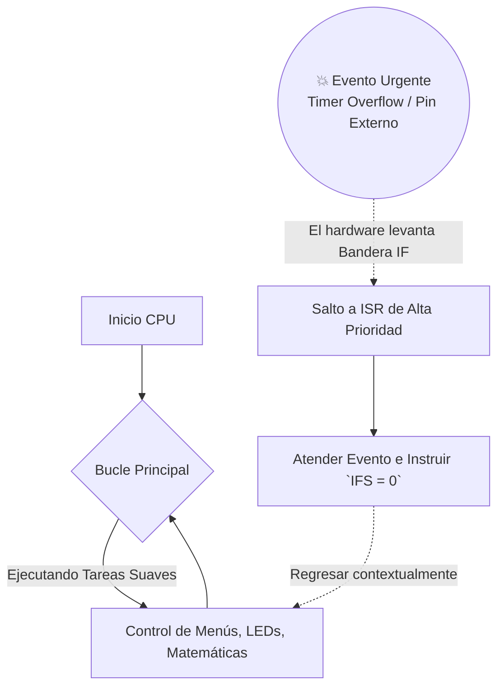
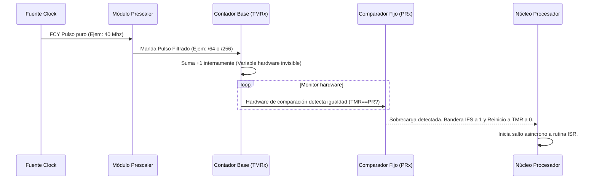

# 🚀 Guía Definitiva: Sistema de Interrupciones y Timers (dsPIC33F)

> [!NOTE]
> **Origen:** Este documento es una síntesis unificada, corregida y mejorada pedagógicamente.
> **Fuentes procesadas para esta unificación:** Family Reference Manual (Secciones 6 y 11), Datasheet dsPIC33F (Sec. 7, 12, 13), Trabajos Prácticos y material complementario de cátedra de la materia.

---

## 1. El Concepto Funcional de las Interrupciones

Una **Interrupción** es una asimetría obligatoria en el flujo del software: es una señal originada en **hardware** o software periférico que le exige atención inmediata y absoluta a la CPU. 
Al dispararse, la CPU "congela" su trabajo principal, guarda su contexto en la pila (`Stack`), atiende la emergencia mediante una **ISR** (rutina de servicio de interrupción), y finalmente, ejecuta una instrucción en ensamblador llamada `RETFIE` para volver al hilo principal en el punto exacto donde se detuvo.

### 1.1 Diferencia Crítica: Interrupción vs Polling

> [!WARNING]
> **El problema del Polling:** Hacer una inspección en bucle cerrado (Polling) consume al $100\%$ el CPU preguntando indefinidamente variables del estilo *"¿Pulsaron el botón?"* o *"¿Me llegó un dato?"*. 
> **La solución:** Entregar este monitoreo al hardware de interrupciones libera de carga inútil a tu hilo principal y permite incorporar **Multitarea (Multitasking)** real.



### 1.1.1 El "Congelamiento" a Bajo Nivel (Uso de W15 y la Pila)

En la arquitectura del dsPIC33, el registro **W15 actúa físicamente como el Puntero de Pila (Stack Pointer - SP)**.
Cuando ocurre una interrupción legítima, el hardware no simplemente "pausa" el código por arte de magia, sino que ejecuta una secuencia estricta y automática en nanosegundos (aprox 4 a 5 ciclos de instrucción):

1. **Fin de ciclo:** La CPU termina de ejecutar la instrucción que estaba procesando en ese instante exacto para evitar corrupción.
2. **Salvamento del PC:** En ese momento, la CPU necesita recordar en qué línea de código iba. Para ello, toma el **PC (Program Counter)** actual (que marca la dirección exacta por donde iba el `main`) y lo **apila (push) en la Pila (Stack)** utilizando la dirección de memoria apuntada por **W15**. 
3. **Salvamento del SR:** Además del PC, el hardware automáticamente apila la parte baja del Registro de Estado (**SRL**), que contiene información valiosa como si había "acarreo" (Carry) o si el resultado anterior fue Cero (Zero). Al hacer esto, **W15** se incrementa automáticamente para apuntar a la nueva cima vacía de la pila.
4. **Barrera de Prioridad:** La CPU actualiza sus propios bits **IPL** en el Status Register para igualarlos a la prioridad de la interrupción entrante. Si entra el Timer1 configurado en nivel 6, la CPU se eleva a nivel 6. *Ninguna otra interrupción de nivel 5 o menor podrá interrumpirla ahora.*
5. **El Salto al IVT:** Ahora que sus "recuerdos" están seguros en la pila de W15, el PC se sobreescribe con la dirección alojada en la **Tabla de Vectores (IVT)** y la función `_TxInterrupt` comienza a correr.
6. **Despertar (`RETFIE`):** Cuando la función C encuentra la última llave `}`, el compilador inyectó silenciosamente allí la instrucción en ensamblador **`RETFIE`** (Return From Interrupt). Esta mágica instrucción obliga al CPU a hacer todo el proceso inverso: **Desapila el SR y el PC** (restándole a W15) y reanuda el `main` con absoluto disimulo.

> [!TIP]
> **Registros Sombra (Shadow Registers):** En el dsPIC33, si tu interrupción tiene la máxima prioridad de todas (**Nivel 7**), el hardware tiene un truco extra: no gasta tiempo apilando tus registros de trabajo (W0 a W3), sino que los copia instantáneamente a unos registros "sombra". ¡Por eso una interrupción de Nivel 7 arranca mucho más rápido que las demás!

### 1.1.2 Mapa de Memoria: ¿Dónde están ubicados físicamente?
El dsPIC33 utiliza una **Arquitectura Harvard Modificada**, lo que significa que la "Memoria de Programa" (Memoria Flash / ROM) donde vive tu código y la "Memoria de Datos" (RAM) para tus variables, tienen números de direcciones completamente distintos y separados.

| Componente | Residencia de Hardware | Dirección Física (Hexadecimal) | Descripción Lógica |
| :--- | :--- | :--- | :--- |
| **W15 (Stack Pointer) y W0-W14** | **Memoria de Datos** (RAM) | `0x0000` a `0x001E` | Aunque W15 gestiona el cerebro de la CPU, está mapeado como SFR al **inicio absoluto** de la memoria de Datos. El propio registro W15 ocupa la dirección física `0x001E`. |
| **La Pila (Memoria del Stack)** | **Memoria de Datos** (RAM) | Suele iniciar a partir de `0x0800`* | La gigantesca Pila donde se guardan los retornos y variables temporales vive en la memoria RAM general. Empieza en el primer hueco libre que deje tu código C después de declarar las variables globales. Cuidado: Crece hacia "arriba" (hacia direcciones de mayor numeración). |
| **Tabla Vectores (IVT)** | **Memoria de Programa** (Flash) | `0x000004` a `0x0000FF` | Es índice fijo (hardware). Grabado en memoria No Volátil, asegura que, sin importar apagones, los eventos de hardware siempre sepan su dirección vital. |
| **Tabla Alternativa (AIVT)** | **Memoria de Programa** (Flash) | `0x000100` a `0x0001FF` | Opcional, continúa justo debajo de la principal. Protegida contra modificaciones erráticas. |
| **Tu Código C (Main e ISR)** | **Memoria de Programa** (Flash) | De `0x000200` en adelante | Las instrucciones ensambladas reales de tu programa empiezan aquí, y es aquí a donde apunta el contenido matemático almacenado adentro de la IVT. |
*(Nota del compilador: Los primeros ~2 Kilobytes de RAM `0x0000-0x07FF` están reservados exclusivamente para los registros especiales (SFR) y los núcleos del dsPIC).*

> [!NOTE]
> **¿Por qué las direcciones de Programa son más largas (`0x000200`) que las de Datos (`0x0800`)?**
> ¡Alguien prestó atención a los ceros! El dsPIC33 es un micro de **16 bits**, por lo que su Memoria de Datos (RAM) es pequeña y rápida, direccionándose con 16 bits limitados a 4 dígitos hexadecimales (máximo `0xFFFF`). 
> Sin embargo, las instrucciones operativas (tu código C convertido a máquina) ocupan un ancho enorme de **24 bits** cada una. Para albergar e identificar instrucciones tan anchas, el **Program Counter (PC)** y el bus de la Memoria de Programa están diseñados físicamente a 24 bits, expresándose en 6 dígitos hexadecimales (por eso el IVT empieza en un largo `0x000004` y no en un `0x04`).

### 1.2 Anatomía del Directorio: La Tabla IVT
Para no correr en el caos, el dsPIC cuenta con un mapa exacto "grabado a fuego" en su memoria Flash (empezando en la dirección `0x000004`) llamado **IVT (Interrupt Vector Table)**. 
Cada vez que llega una interrupción válida, el hardware ubica la prioridad de ese evento y hace una consulta matemática a esta tabla para encontrar en qué línea oculta de memoria empieza la función C que tú programaste para salvarlo.

### 1.3 Las "Trampas" (Traps) vs Las "Interrupciones"
Una trampa es conceptualmente idéntica a una interrupción, salvo por un gran detalle: **Las trampas son indiscutibles y no enmascarables**.
Las trampas ostentan los niveles de prioridad de CPU 8 a 15 (los valores superiores absolutos que existen).
- **Hard Traps:** Reacciona a fallas del oscilador central o a un error crítico de dirección. Detienen al CPU por el cuello para que no destruya memoria crítica.
- **Soft Traps:** Errores como `Stack Overflow` o un error matemático (escrutar una división por 0 en la ALU). Al ser suaves, la CPU permitirá completar la instrucción en tránsito antes de saltar a la trampa para registrar el daño.

---

## 2. Los Cuatro Pilares: Registros de Control

Microchip estructuró todo su motor de interrupciones utilizando 4 sufijos clave en sus arquitecturas. Si comprendes esta matriz, no existirá obstáculo al configurar interrupciones en ningún sistema Microchip.

| Registro | Funcionalidad en Hardware | Analogía de Concepto 💡 |
| :--- | :--- | :--- |
| **IFSx** (*Interrupt Flag Status*) | Es el "detector". El hardware la clava forzosamente en `1` cuando ocurre el suceso electrónico. **OBLIGACIÓN PROG:** Una vez iniciada la función, el código debe volver a limpiarla escribiéndole a nivel bit un `0` manual, o fallará catastróficamente la ISR repetitiva. | El sonido vibrante del timbre que avisa de una urgencia. |
| **IECx** (*Interrupt Enable Control*) | Es el enmascarador maestro del timbre. Si está forzado a `0`, la señal de urgencia electrónica puede chillar fuerte afectando al `IFS` continuamente, pero **el procesador nunca lo "escuchará"** ni detendrá el código general. | El control físico para bloquear/cortar alarmas. |
| **IPCx** (*Interrupt Priority Control*) | Registra qué nivel de urgencia asumes para dicho periférico. Varía del 0 (Ignorar todo) al 7 (Urgencia Extrema Máxima). | Es el sistema de Triaje de un Hospital para ceder paso a las peores variables. |
| **INTCONx** (*Interrupt Control*) | Son configuraciones universales arquitectónicas. Gobiernan temas profundos como la anulación del **anidamiento** o de forma particular las polaridades activas (configurar que un flanco se dispare de 1 a 0 en vez de 0 a 1). | Las normas estatales de funcionamiento del Hospital mismo. |

> [!CAUTION]  
> **Prioridad Natural (Conflicto Matemático):** ¿Qué ocurre si dos módulos periféricos explotan al mismo tiempo exacto y tú les habías establecido a ambos por código la misma prioridad de urgencia `(Ej. IPC = 5)`?
> En este escenario de empate absoluto, la CPU resolverá la crisis revisando los números de Vector ordenados de su IVT; el valor numérico menor dictará precedencia sobre el otro (Ej. INT0 atenderá antes que el Timer3 porque INT0 está codificado más arriba en el silicio).

### 2.1 La Batalla de Prioridades: CPU vs Periférico (El nivel IPL)

Para que el dsPIC33 decida si detiene lo que está haciendo o ignora un evento, existe una "batalla numérica" entre el dispositivo y el propio núcleo del procesador:

1. **La Condición Estricta:** La prioridad configurada para un dispositivo periférico (`IPCx`, que va del 0 al 7) debe ser **ESTRICTAMENTE MAYOR** a la prioridad actual que tiene la CPU para poder interrumpirla. *Ejemplo: Si la CPU está procesando una tarea vital en nivel 4, solo periféricos con IPC de 5, 6 o 7 podrán robarle la atención.*
2. **El Escudo de la CPU (`IPL<3:0>`):** La CPU define su nivel actual de "concentración" usando un parámetro de 4 bits llamado **IPL (Interrupt Priority Level)**. 
3. **El Registro Modificable (`SR`):** Los tres bits más bajos de esta prioridad (`IPL<2:0>`) residen en el registro **SR (Status Register)**. Estos sí son accesibles; tú como programador puedes subir o bajar esta "barrera" temporalmente en tu código para proteger operaciones matemáticas sensibles de las interrupciones molestas.
4. **El Bit Intocable (`CORCON`):** El cuarto bit (`IPL<3>`) está escondido en el registro de núcleo **CORCON**. **NO es accesible** por el programador bajo ningún concepto. El hardware lo pone en `1` unilateralmente solo cuando ocurre un **TRAP** (Un error catastrófico). Esto eleva mágicamente a la CPU a prioridades de 8 a 15, volviéndola inmune hasta a la interrupción de hardware más crítica (que como máximo llega a 7).
5. **El Orden Natural (IVT):** Si hay empate de prioridades entre dos eventos, el HW mira la tabla **IVT**; el periférico programado en una dirección de memoria menor gana el desempate por orden natural de diseño.

> [!NOTE]
> **¿Dónde encuentro la información de Hardware y Pines (`INTx`) en la bibliografía oficial?**
> - 📄 [**`dsPic33FJ256GP710-70286C (Datasheet).pdf`**](file:///d:/Escritorio/INFORMATICA/ARQUITECTURA%20DE%20COMPUTADORAS/dsPic33FJ256GP710-70286C%20(Datasheet).pdf) *(Manual específico del chip real)*
>   - **Mapeo Físico:** En la sección inicial **"Pin Diagrams" (Aprox. Páginas 4 a 10)**. Busca las patas rotuladas como `INT0`, `INT1`, o `CNx`. *(Cuidado: están "multiplexados", es decir, comparten pata con los pines normales como RB7).*
>   - **Registros dedicados:** **Sección 7.0 "Interrupt Controller"**. Enumera exactamente qué vectores posee tu chip.
> - 📄 [**`DsPIC33 - Interrupts -DS70184b.pdf`**](file:///d:/Escritorio/INFORMATICA/ARQUITECTURA%20DE%20COMPUTADORAS/PRACTICA%202/DsPIC33%20-%20Interrupts%20-DS70184b.pdf) *(Family Reference Manual)*
>   - Explica el concepto profundo de arquitectura **(Section 6)**, pero obvia los números de pines porque sirve para más de 100 procesadores dsPIC distintos.

### 2.2 Guía de Lectura: ¿Cómo interpretar una tabla de registros del Datasheet?

El Diccionario y las tablas de arriba te dicen *dónde* buscar cada registro. Pero cuando abrís el Datasheet real, te vas a encontrar con tablas como esta que muestran *cómo está organizado el registro por dentro*. Acá te enseño a leerlas usando como ejemplo el **IPC1 (Interrupt Priority Control 1)** que está en la dirección `0x00A6` de la Memoria de Datos.

#### Representación visual de los 16 bits del registro IPC1

```
  bit 15    14    13    12    11    10     9     8     7     6     5     4     3     2     1     0
┌──────┬─────┬─────┬─────┬──────┬─────┬─────┬─────┬──────┬─────┬─────┬─────┬──────┬─────┬─────┬─────┐
│  U-0 │R/W-1│R/W-0│R/W-0│  U-0 │R/W-1│R/W-0│R/W-0│  U-0 │R/W-1│R/W-0│R/W-0│  U-0 │R/W-1│R/W-0│R/W-0│
│  —   │     T2IP<2:0>   │  —   │    OC2IP<2:0>   │  —   │    IC2IP<2:0>   │  —   │   DMA0IP<2:0>  │
└──────┴─────┴─────┴─────┴──────┴─────┴─────┴─────┴──────┴─────┴─────┴─────┴──────┴─────┴─────┴─────┘
```

#### Paso 1: Entender la estructura de los bits (El mapa)
El registro es de 16 bits (del 0 al 15). Están agrupados de a **3 bits útiles + 1 bit separador**. Cada grupo de 3 bits controla la **prioridad** de un periférico diferente:

* **Bits 14-12 → `T2IP<2:0>`:** Controlan la prioridad del **Timer 2**.
* **Bits 10-8 → `OC2IP<2:0>`:** Controlan la prioridad del **Output Compare 2**.
* **Bits 6-4 → `IC2IP<2:0>`:** Controlan la prioridad del **Input Capture 2**.
* **Bits 2-0 → `DMA0IP<2:0>`:** Controlan la prioridad del **DMA Canal 0**.

#### Paso 2: ¿Qué significan las siglas de la leyenda?
Esto es clave para saber qué podés hacer con cada bit:

| Sigla | Significado | ¿Qué implica? |
| :--- | :--- | :--- |
| **U-0** | **Unimplemented**, se lee como `0` | El bit no existe o no tiene función. Siempre vale `0`. En IPC1 son los bits 15, 11, 7 y 3 (los separadores). |
| **R/W** | **Readable / Writable** | Podés **leer** el valor actual y también **escribirlo** para cambiar la prioridad. |
| **-n** | **Value at POR** (Power-on Reset) | Es el valor que tiene el bit cuando encendés el micro. Ej: `R/W-1` → arranca en `1`. `R/W-0` → arranca en `0`. |

> [!IMPORTANT]
> **Valor por defecto de las prioridades:** Fijate que los bits de cada grupo arrancan en `1-0-0` (binario = **4**). Esto significa que al encender el micro, **todas las interrupciones arrancan con prioridad 4 por defecto**, y la CPU arranca con IPL = 0. Por eso cualquier interrupción habilitada puede interrumpir al `main()` sin que vos toques nada.

#### Paso 3: Cómo configurar la prioridad (El valor de los 3 bits)
Como cada periférico tiene **3 bits** asignados, podés codificar un número del 0 al 7 en binario:

| Binario | Decimal | Efecto |
| :--- | :--- | :--- |
| `111` | **7** | Prioridad **máxima**. Gana ante cualquier otro periférico con menor número. |
| `101` | **5** | Prioridad alta. |
| `100` | **4** | Prioridad **por defecto** al encender el micro. |
| `001` | **1** | Prioridad **mínima** (pero sigue activa). |
| `000` | **0** | ⚠️ **Interrupción DESHABILITADA** para ese periférico, aunque el bit de Enable (`IEC`) esté en 1. |

#### Ejemplo práctico en código C
Si necesitás que el **Timer 2** tenga una prioridad de **5**, tendrías que poner el binario `101` en los bits 14, 13 y 12 del registro IPC1. En C con XC16, el compilador te lo simplifica:

```c
IPC1bits.T2IP = 5; // El compilador sabe que esto apunta a los bits 14:12 de IPC1 (0x00A6)
```

> [!TIP]
> **¿Cómo se conecta todo?** En la tabla de vectores del Datasheet (Sección 7.0), en la fila del **Timer 2**, la columna "Priority" te dice `IPC1<14:12>`. Eso es exactamente el campo `T2IP` que acabamos de leer en la hoja de datos. **El Diccionario te dice la dirección (`0x00A6`), la tabla de vectores te dice qué bits usar (`14:12`), y esta guía te enseña a leer qué significan.**

---

## 3. Temporizadores Cíclicos (Los Módulos *Timers*)

Los Timers son los metrónomos inamovibles del microcontrolador. Son rutinas de Hardware ajenas al peso de la instrucción programada en código. Los dsPIC33 incluyen **múltiples cronometradores paralelos de 16-bits**, que se clasifican para la eficiencia en modelos **Tipo A, B y C**.

1.  **Modelo Tipo A (El Timer 1 por excelencia):** Es asíncrono y versátil. Especial por su capacidad de funcionar incluso estando el sistema en modulación 'dormida'. Posee conexiones físicas dedicadas para construir un RTC (Hardware Clock de cuarzo de 32 KHz).
2.  **Modelo Tipo B (Timers 2, 4, 6 y 8):** Dedicados y especializados con la genialidad de enclavarse a los modelos tipo C para crear un **Timer contiguo de 32 bits** supermasivo para control de motores muy finos y bases PWM.
3.  **Modelo Tipo C (Timers 3, 5, 7 y 9):** Suplen los perfiles esclavos/emparejables del Tipo B.

### 3.0 ¿Cómo funciona físicamente un Timer?

Para entender cómo funciona un **Timer** (temporizador) en un microcontrolador como el dsPIC33F, imaginalo como un contador digital de pulsos de reloj. Físicamente, es un módulo de hardware independiente que "observa" los latidos del procesador y suma uno en un registro interno cada vez que detecta un latido.

Aquí te explico cada concepto desglosado físicamente:

#### A. ¿Qué significa una frecuencia de 40 MHz?
En el contexto de los timers, nos referimos a la **frecuencia de instrucción ($Fcy$)**.
*   **Físicamente:** Es el "latido del corazón" interno del microcontrolador. Si tenés 40 MHz, significa que el reloj interno genera **40 millones de pulsos por segundo**.
*   **El tiempo ($Tcy$):** A partir de esto, calculamos cuánto dura un solo latido: $Tcy = 1 / 40\text{ MHz} = 0,025\text{ }\mu\text{s}$ (25 nanosegundos). Sin nada que lo detenga, el timer sumaría "1" cada 25 nanosegundos.

#### B. ¿Qué hace el Prescaler?
El **Prescaler** funciona físicamente como una **caja de cambios** o un divisor de frecuencia antes de que el pulso llegue al contador del timer.
*   **Físicamente:** Es un circuito que recibe los pulsos de 40 MHz pero solo deja pasar uno después de que hayan ocurrido "N" pulsos.
*   **Ejemplo:** Si configurás un prescaler de **1:64**, el timer no contará cada 25 nanosegundos. En su lugar, esperará a que pasen **64 latidos** del procesador para sumar recién "1" en su registro interno.
*   **Utilidad:** Sirve para que el timer no se llene (desborde) tan rápido y te permita medir tiempos más largos.

#### C. ¿Qué hacen el PRx o PR1?
El **PR (Period Register)** es el "límite" o el valor de la **alarma** que vos configurás.
*   **Físicamente (El Comparador):** Dentro del chip hay un circuito llamado "Comparador de Igualdad". Este circuito mira constantemente dos cosas: el valor actual del contador (**TMR1**) y el valor que vos grabaste en el registro de periodo (**PR1**).
*   **La Ruptura:** Cuando el contador $TMR1$ llega a ser exactamente igual al valor en $PR1$, ocurren tres cosas instantáneamente por hardware:
    1.  El contador **TMR1 se reinicia a cero** automáticamente.
    2.  Se levanta una "bandera" (el bit **T1IF** se pone en 1) para avisar que el tiempo se cumplió.
    3.  Si las interrupciones están habilitadas, la CPU deja lo que está haciendo y salta a la **Rutina de Servicio de Interrupción (ISR)**.

#### D. Cómo contar el tiempo (La lógica física)
Para medir un tiempo exacto (por ejemplo, **25 ms**), vos ajustás los "engranajes" para que la alarma ($PR1$) suene justo en ese momento.

La fórmula física que conecta todo es:
$$t = Tcy \cdot \text{Prescaler} \cdot PR1$$

Si querés **25.000 $\mu$s (25 ms)** con un reloj de **0,025 $\mu$s (40 MHz)** y un prescaler de **64**:
1.  Cada incremento del timer ahora vale: $0,025 \mu s \cdot 64 = 1,6 \mu s$.
2.  Para llegar a los 25.000 $\mu$s, ¿cuántas veces debe sumar el timer?
3.  $PR1 = 25.000 / 1,6 = \mathbf{15.625}$.

#### E. Aclaración del funcionamiento paso a paso (TMR y Prescaler)
Para asegurar que el concepto está claro, respondamos una duda común: *¿El que cuenta los pulsos es el TMR? ¿Es decir, cada $0,025 \mu s$ si el prescaler está en 1 cuenta uno, y si el prescaler está en 64 el TMR cuenta uno cada $1,6 \mu s$?*

**Exactamente, así es.** Físicamente, el registro que lleva la cuenta es el **TMRn** (como el TMR1), el cual se incrementa en cada pulso que le llega **después** de pasar por el divisor de frecuencia o prescaler.
*   **Prescaler en 1:1:** No hay división. El contador **TMRn suma "1" cada $0,025 \mu s$**.
*   **Prescaler en 1:64:** El circuito espera a que pasen 64 pulsos de reloj para dejar pasar solo uno al contador. Por lo tanto, el **TMRn suma "1" cada $1,6 \mu s$**.

Mientras el **TMR1** va sumando esos pasos, el **comparador de igualdad** lo observa. En el momento exacto en que el valor del **TMR1 iguala al valor que cargaste en el PR1**, ocurren los eventos automáticos por hardware: se levanta la bandera **T1IF**, el contador **TMR1 se reinicia a cero** y se salta a la ISR.

**En resumen:** El procesador late a 40MHz, el prescaler ralentiza esos latidos para que el contador ($TMR1$) no corra tan rápido, y el $PR1$ es la meta donde el comparador físico dispara la interrupción.

### 3.1 Los Registros Fundamentales del Timer

Al igual que el complejo sistema de interrupciones general, el módulo del Timer se controla dominando tres ubicaciones de memoria específicas:

| Registro Físico | Acrónimo | Misión del Hardware | Analogía Práctica |
| :--- | :--- | :--- | :--- |
| **Timer Counter** | `TMRx` | Es la **"variable" contadora viva**. Inicia en `0` y se incrementa en `+1` de manera autónoma con cada pulso que sale del prescaler. Nunca se detiene hasta chocar el límite. | El segundero que avanza constantemente. |
| **Period Register** | `PRx` | Es **el límite matemático**. Contiene el parámetro máximo que tú configuraste y quieres que el timer cuente. El comparador de hardware vigila si `TMRx == PRx`. Si lo es, explota la bandera `IFSxbits.TxIF` y reinicia el sistema a cero automáticamente. | La aguja de la alarma programada a las 06:00 AM. |
| **Timer Control** | `TxCON` | Es el panel de **Control Maestro**. Agrupa todos los botones para configurar y energizar al módulo. | Los diales de perilla al costado de un reloj de pulsera. |

#### Los Bits Claves (El Panel de Control `TxCON`):
- **`TON` (Timer On):** Literalmente la llave de paso del motor (`1` = ON, `0` = OFF).
- **`TCKPS` (Pre-scaler Select):** La "caja de cambios" (Ocupa 2 bits). Ralentiza el ritmo al que avanza el contador dividiendo su reloj fuente por valores como `1:1`, `1:8`, `1:64` o `1:256`. 
- **`TCS` (Timer Clock Source):** Interruptor de señal. Al estar en `0`, usa el corazón interno a altísima velocidad (`FCY`). Al ponerlo en `1`, se "sorda" internamente y pasa a recibir pulsos ingresados desde un pin físico del micro (ej. Pin T1CK), convirtiendo al Timer en un **contador de eventos externos** de poleas o sensores.

> [!NOTE]
> **¿Dónde encuentro la información de Hardware y Pines de Timers en la bibliografía oficial?**
> Para utilizar el modo "Contador", inyectando señales desde el mundo real a través del pin externo (configurando `TCS = 1` o `TGATE`), debes saber a qué pata soldar tu circuito.
> - 📄 [**`dsPic33FJ256GP710-70286C (Datasheet).pdf`**](file:///d:/Escritorio/INFORMATICA/ARQUITECTURA%20DE%20COMPUTADORAS/dsPic33FJ256GP710-70286C%20(Datasheet).pdf) *(Manual específico del chip real)*
>   - **Mapeo Físico:** De nuevo, acude a **"Pin Diagrams" (Páginas 4 a 10)** y busca rotulados como **`T1CK`**, **`T2CK`**, etc.
>   - **Registros y Diagramas del hardware:** Dirígete a **Sección 12.0 "Timer1"** y **Sección 13.0 "Timer2/3, Timer4/5..."**.
> - 📄 [**`manual_referencia_dsPIC33F_11_timers.pdf`**](file:///d:/Escritorio/INFORMATICA/ARQUITECTURA%20DE%20COMPUTADORAS/PRACTICA%202/manual_referencia_dsPIC33F_11_timers.pdf) *(Family Reference Manual)*
>   - Expone toda la matemática y los modos de operación **(Section 11)**, pero jamás te mostrará los pines.

### 3.1.1 Guía de Lectura: Tabla General de Registros de Timer (Table 11-4)

Cuando abrís la **Sección 11 del Family Reference Manual**, lo primero que te aparece es una tabla panorámica con **todos** los registros de **todos** los timers. Es intimidante al principio, pero en realidad es un resumen compacto que te dice qué bits existen en cada registro y con qué valor arrancan al encender el micro.

#### Reproducción simplificada de la Tabla 11-4:

| SFR Name | Bit 15 | Bit 14 | Bit 13 | ... | Bit 6 | Bit 5-4 | Bit 3 | Bit 2 | Bit 1 | Bit 0 | Reset |
| :--- | :--- | :--- | :--- | :--- | :--- | :--- | :--- | :--- | :--- | :--- | :--- |
| **TMR1** | | | | Timer1 Register (16 bits de contador) | | | | | | | `xxxx` |
| **PR1** | | | | Period Register 1 (16 bits de límite) | | | | | | | `FFFF` |
| **T1CON** | TON | — | TSIDL | — | TGATE | TCKPS | — | TSYNC | TCS | — | `0000` |
| **TMRx** | | | | Timerx Register (Tipo B) | | | | | | | `xxxx` |
| **TMRyHLD** | | | | Timery Holding Register (solo 32-bit) | | | | | | | `xxxx` |
| **TMRy** | | | | Timery Register (Tipo C) | | | | | | | `xxxx` |
| **PRx** | | | | Period Register x (Tipo B) | | | | | | | `FFFF` |
| **PRy** | | | | Period Register y (Tipo C) | | | | | | | `FFFF` |
| **TxCON** | TON | — | TSIDL | — | — | TGATE | TCKPS | — | T32 | TCS | `0000` |
| **TyCON** | TON | — | TSIDL | — | — | TGATE | TCKPS | — | — | TCS | `0000` |

#### ¿Cómo leer esta tabla?

1. **Columna "SFR Name":** Es el nombre del registro que usás en tu código C (ej: `TMR1`, `T1CON`).
2. **Columnas de Bits (15 a 0):** Te muestran qué "perilla" o función vive en cada posición. Si ves un guion largo (`—`) significa que ese bit **no se usa** (Unimplemented).
3. **Columna "Reset":** Es el valor hexadecimal que tiene el registro al encender el micro. Esto es clave:
   * **`xxxx`** en TMR1 significa que el contador arranca con un **valor desconocido**. Por eso siempre lo ponés a cero antes de arrancar (`TMR1 = 0;`).
   * **`FFFF`** en PR1 significa que el periodo arranca en su **valor máximo** (65535). Si no lo configurás, el timer contará hasta 65535 antes de generar la interrupción.
   * **`0000`** en T1CON significa que el timer arranca **apagado** (`TON = 0`), con prescaler 1:1 (`TCKPS = 00`) y usando el reloj interno (`TCS = 0`).

4. **Las letras `n`, `x`, `y`:** Son comodines que te dicen a qué tipo de timer aplica:
   * `n` = Cualquier timer (1 a 9).
   * `x` = Solo Timers Tipo B (2, 4, 6, 8).
   * `y` = Solo Timers Tipo C (3, 5, 7, 9).

> [!IMPORTANT]
> **El bit `T32` solo existe en los TxCON (Tipo B).** Cuando lo ponés en `1`, fusionás el Timer Tipo B con su vecino Tipo C para crear un **super-timer de 32 bits**. Ejemplo: `T2CONbits.T32 = 1;` fusiona el Timer2 + Timer3.

### 3.1.2 Guía de Lectura: Registro T1CON bit a bit (Register 12-1)

Ahora que ya sabés leer la tabla panorámica, vamos a hacer zoom en un registro concreto. Así es como aparece el **T1CON** cuando abrís la **Sección 12.0** del Datasheet:

#### Representación visual de los 16 bits de T1CON (`0x0104`)

```
  bit 15    14    13    12    11    10     9     8     7     6     5     4     3     2     1     0
┌──────┬─────┬─────┬─────┬──────┬─────┬─────┬─────┬──────┬─────┬─────┬─────┬──────┬─────┬─────┬─────┐
│R/W-0 │ U-0 │R/W-0│ U-0 │  U-0 │ U-0 │ U-0 │ U-0 │  U-0 │R/W-0│R/W-0│R/W-0│  U-0 │R/W-0│R/W-0│ U-0 │
│ TON  │  —  │TSIDL│  —  │   —  │  —  │  —  │  —  │   —  │TGATE│  TCKPS<1:0> │  —  │TSYNC│ TCS │  —  │
└──────┴─────┴─────┴─────┴──────┴─────┴─────┴─────┴──────┴─────┴─────┴─────┴──────┴─────┴─────┴─────┘
```

#### Desglose de cada bit funcional:

| Bit(s) | Nombre | Tipo | Reset | Función |
| :--- | :--- | :--- | :--- | :--- |
| **15** | `TON` | R/W | 0 | **Interruptor de encendido.** `1` = Timer1 encendido y contando. `0` = Apagado. |
| **14** | — | U | 0 | No implementado. |
| **13** | `TSIDL` | R/W | 0 | Si vale `1`, el timer se detiene cuando la CPU entra en modo Idle (ahorro de energía). |
| **12-8** | — | U | 0 | No implementados. |
| **7** | — | U | 0 | No implementado. |
| **6** | `TGATE` | R/W | 0 | **Modo Compuerta.** Si vale `1`, el timer solo cuenta mientras un pin externo esté en alto. |
| **5-4** | `TCKPS<1:0>` | R/W | 00 | **Prescaler.** Divisor de frecuencia del reloj: `00`=1:1, `01`=1:8, `10`=1:64, `11`=1:256. |
| **3** | — | U | 0 | No implementado. |
| **2** | `TSYNC` | R/W | 0 | **Sincronización.** Solo aplica cuando usás reloj externo (`TCS=1`). Si vale `1`, sincroniza los pulsos externos con el reloj interno de la CPU. |
| **1** | `TCS` | R/W | 0 | **Selector de Reloj.** `0` = Reloj interno (FCY). `1` = Reloj externo por pin T1CK. |
| **0** | — | U | 0 | No implementado. |

> [!CAUTION]
> **Orden de configuración obligatorio:** Siempre configurá **todos los bits de TxCON ANTES** de poner `TON = 1`. Si encendés el timer primero y después cambiás el prescaler o la fuente de reloj, podés generar comportamientos impredecibles. El orden seguro es:
> 1. `T1CON = 0;` → Apagar y limpiar todo.
> 2. `TMR1 = 0;` → Poner el contador a cero.
> 3. `PR1 = valor;` → Cargar el periodo deseado.
> 4. `T1CONbits.TCKPS = 0b11;` → Configurar el prescaler (ej: 1:256).
> 5. `T1CONbits.TON = 1;` → **Último paso:** Encender el motor.

#### Ejemplo práctico completo en código C

```c
// Configurar Timer1 para generar una interrupción cada 250 ms (0.25 segundos)
// Asumiendo Fosc = 80MHz → Fcy = 40MHz → Tcy = 25ns

T1CON = 0;              // Paso 1: Apagar y resetear todo el registro de control
TMR1 = 0;               // Paso 2: Contador a cero
PR1 = 39062;            // Paso 3: Periodo = 0.25s / (25ns * 256) ≈ 39062
T1CONbits.TCKPS = 0b11; // Paso 4: Prescaler 1:256
IFS0bits.T1IF = 0;       // Limpiar bandera por si estaba sucia
IEC0bits.T1IE = 1;       // Habilitar interrupción del Timer1
T1CONbits.TON = 1;       // Paso 5: ¡ENCENDER! (siempre al final)
```

### 3.2 Ingeniería de la Ecuación del Cronometrador
> [!TIP]
> **Fórmula Universal Dinámica de Temporización XC16:**
> $$Tiempo\;Deseado\;(t) = \frac{1}{Fcy} \times Prescaler \times PRx$$
> Donde $Fcy = \frac{Fosc}{2}$. Esto infiere que con un cristal oscilando a `80MHz` físicamente, internamente tu procesador orquesta a 40 Millones de Instrucciones/Seg ($Fcy = 40MHz \rightarrow Ciclo \; de \; instrucción \; [Tcy] = 0.025 \mu s$).

### 3.3 Diagrama Operativo Interno del Hardware Timer



---

## 4. Guía Sintáctica Infalible para el Entorno C (MPLAB X)

Las interrupciones exigen orden estructurado. La teoría condensada en un flujo de código de la Cátedra es la siguiente:

#### 1) Iniciador y Setup (Generalmente modularizado en `void inicializarTimer1()`)
```c
// [ETAPA A] Asegurar la desactivación general mientras configuramos al microcontrolador
T1CONbits.TON = 0;      

// [ETAPA B] Aritmética de Tiempo (Configurada por Fcy * PS * PR calculado a mano)
T1CONbits.TCKPS = 0b10; // Instalar divisor de Preescalamiento (ej. 1:64)
PR1 = 15625;            // La limitante a cargar para disparar una ruptura

// [ETAPA C] Privilegios y Banderas en Cero
IPC0bits.T1IP = 6;      // Ordenarle importancia operativa nivel 6.
IFS0bits.T1IF = 0;      // Acallar posibles ruidos electrónicos residuales
IEC0bits.T1IE = 1;      // Girar llave maestra para que la CPU lo escuche globalmente

// [ETAPA FINAL] Iniciar ciclo
T1CONbits.TON = 1;      // Dar rienda suelta
```

#### 2) Entramado de las funciones Callbacks (ISR - Receptores asíncronos)
Microchip utiliza extensiones estandarizadas del compilador para incrustar tus funciones en Memoria Exacta sin ensamblador. 

```c
// Atributo imperativo de Compilación que enlaza este código al hardware exacto!
void __attribute__((__interrupt__, no_auto_psv)) _T1Interrupt(void) {
    
    /* TU INGENIERÍA DE INTERRUPCIÓN (Ej. Prender parpadear LED) */
    /* LATBbits.LATB2 = ~LATBbits.LATB2;                          */
    
    // EXTREMADAMENTE OBLIGATORIO: ¡Apagar la bandera remanente antes de entregar contexto!
    IFS0bits.T1IF = 0; 
}
```

> [!CAUTION]
> **El gran error de los parciales:** Omitir la instrucción **`IFSxbits.TxIF = 0;`** al salir condena repetitiva y permanentemente al hardware a reingresar a esta función una y otra vez (creyendo que el evento no fue atendido), causando un cuelgue fantasma permanente del Microcontrolador.

---

## 5. Caso Práctico: Proyecto Base 2 (Timer + INT0 + LEDs)

Para aterrizar todo el comportamiento de interrupciones, analizamos el comportamiento conjunto del **Timer1**, una **Interrupción Externa (INT0)** y un **Puerto de Salida (PORTA / LATA)**.

### A. Trabajo en equipo de 2 interrupciones independientes
Es crucial entender que el Timer y las interrupciones externas operan en paralelo sin molestarse:
1. **Timer1:** Cuenta el "tiempo" internamente. Avanza solo, pase lo que pase, funcionando como el reloj que marca una **ventana de tiempo** fija (ej. cada 4 segundos).
2. **INT0 (Pulsos):** Funciona como un contador de eventos. Solo avanza cuando ocurre un evento físico en el mundo exterior (un botón presionado que genera un flanco ascendente).

**Analogía:** El Timer es el cronómetro y el INT0 es el contador de vueltas. Juntos permiten crear sistemas como un frecuencímetro o medidor de RPM.

### B. Mapeo Físico y Multiplexado (¿Por dónde entra la corriente?)
Para que el microcontrolador "sienta" la interrupción, el pulso eléctrico (una transición de 0V a 3.3V/5V) debe ingresar físicamente por pines específicos. Los pines de un dsPIC están **multiplexados**, es decir, una misma pata metálica sirve para varias funciones.
Ejemplos de mapeos vitales:
*   **INT0:** La señal debe ingresar por el pin compartido con **RE8** (Puerto E, bit 8).
*   **INT1:** Pin compartido con **RE9**.
*   **INT2:** Pin compartido con **RE10**.
*   **Timer1 (T1CK):** Si en lugar de usar el oscilador interno del micro configuramos el Timer como contador de pulsos externos, la señal debería entrar por el pin **RC14**.

### C. La traducción de Decimal a Binario Físico (LEDs)
Si conectamos 8 LEDs al puerto A y ejecutamos la asignación `LATA = counterINT0;`, el procesador agarra automáticamente el número decimal de pulsos de la variable y enciende/apaga los pines formando el número **en binario puro** ($1 = Encendido, 0 = Apagado$).
*   *Ejemplo:* Si hubo 5 pulsos, los LEDs formarán el patrón `0000 0101` (se encienden el pin 0 y el pin 2).

**El Límite de los 8 bits (Máximo Visual):** 
Al tener exactamente 8 pines/LEDs físicos, el número máximo que pueden formar todos encendidos es el **255** en decimal (`1111 1111` en binario). Si el `counterINT0` detecta 256 pulsos o más, los LEDs empezarán a engañar a la vista: volverán a mostrar `0000 0000` y empezarán de nuevo, ya que los LEDs físicos solo tienen capacidad para mostrar los 8 bits menos significativos del número.
